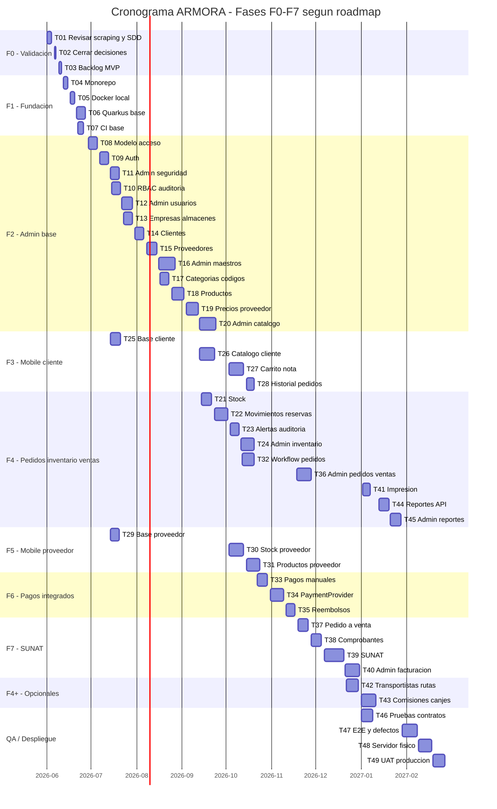

# [SUPERSEDED] Cronograma de desarrollo - Backend Quarkus

> Este cronograma fue la estimacion inicial. Para el seguimiento real de Fase 1, usar `docs/ai_workflow/00_tablero_agentes.md` y `docs/sdd/16_plan_ejecucion_fase_1_fundacion_tecnica.md`.

## Base de estimacion

Documento base principal: `08_sdd_roadmap_mvp.md` (fases canonicas F0-F7).

Documentos guia:

- `02_stack_recomendado.md`
- `04_sdd_requerimientos.md`
- `05_sdd_arquitectura.md`
- `06_sdd_modelo_datos_inicial.md`
- `07_sdd_api_contratos.md`
- `12_revision_respuestas_validacion.md`

Fecha inicial solicitada: 2026-06-01.

## Cambio aplicado

Este cronograma usa todos los dias calendario. No excluye feriados ni festividades.

Las fases estan alineadas con `08_sdd_roadmap_mvp.md` (F0-F7). Tareas que no pertenecen a una fase especifica del roadmap (QA, despliegue, modulos opcionales) se agrupan como F4+ y F transpasa.

El plan mantiene trabajo en paralelo por frentes:

- Backend Quarkus.
- Admin web.
- Mobile cliente.
- Mobile proveedor.
- DevOps.
- QA.
- Direccion/validacion.

Importante: este Gantt supone capacidad simultanea por frente. Si una sola persona ejecuta todo, estas fechas no deben tomarse como compromiso real, porque backend, web, mobile, DevOps y QA competirian por la misma disponibilidad.

## Capacidad usada

| Dia | Entendimiento | Desarrollo | Total usado |
|---|---:|---:|---:|
| Lunes | 0.5h | 3.5h | 4h |
| Martes | 0.5h | 3.5h | 4h |
| Miercoles | 0.5h | 3.5h | 4h |
| Jueves | 0.5h | 3.5h | 4h |
| Viernes | 0.5h | 3.5h | 4h |
| Sabado | 0.5h | 6h | 6.5h |
| Domingo | 0.5h | 3h | 3.5h |

Capacidad semanal por frente: 30h.

La columna `Horas desarrollo` conserva el esfuerzo estimado por actividad. La capacidad diaria ya incluye el bloque de entendimiento de 0.5h.

## Resumen

| Indicador | Valor |
|---|---:|---:|
| Total estimado | 1656h |
| Inicio efectivo | 2026-06-01 |
| Fin estimado con frentes paralelos | 2027-02-27 |
| Modalidad | Trabajo paralelo por frentes |
| Calendario | Todos los dias calendario, sin excluir feriados |
| Backend principal | Quarkus |
| Base de datos | PostgreSQL |
| Web admin | Next.js |
| Mobile | 2 apps Flutter: cliente y proveedor |
| Fases canonicas | F0-F7 segun roadmap 08 |

## Tabla detallada

| ID | Fase | Frente | Tarea | Actividad | Horas desarrollo | Inicio | Fin | Duracion | Depende de |
|---|---|---|---|---|---|---|---|---|---|
| T01 | F0 | Direccion | Validacion y plan | Revisar scraping, SDD y alcance Quarkus | 14 | 2026-06-01 | 2026-06-04 | 4 dias cal. / 4 jornadas |  |
| T02 | F0 | Direccion | Validacion y plan | Cerrar decisiones: stock, pagos, SUNAT, sucursales | 10 | 2026-06-06 | 2026-06-07 | 2 dias cal. / 2 jornadas | T01 |
| T03 | F0 | Direccion | Validacion y plan | Definir backlog MVP y criterios de aceptacion | 12 | 2026-06-09 | 2026-06-11 | 3 dias cal. / 3 jornadas | T02 |
| T04 | F1 | DevOps | Fundacion tecnica | Crear monorepo y estructura apps/api/packages | 18 | 2026-06-12 | 2026-06-15 | 4 dias cal. / 4 jornadas | T03 |
| T05 | F1 | DevOps | Fundacion tecnica | Docker local: PostgreSQL, Redis, Quarkus, Next.js y configuracion Flutter | 18 | 2026-06-17 | 2026-06-20 | 4 dias cal. / 4 jornadas | T04 |
| T06 | F1 | Backend | Fundacion backend | Quarkus REST, OpenAPI, Flyway, perfiles, health | 28 | 2026-06-21 | 2026-06-27 | 7 dias cal. / 7 jornadas | T05 |
| T07 | F1 | DevOps | Calidad base | CI base, lint, formato, testing y convenciones | 18 | 2026-06-22 | 2026-06-26 | 5 dias cal. / 5 jornadas | T05 |
| T08 | F2 | Backend | Identidad y seguridad | Modelo usuarios, roles, permisos y scopes multi-sucursal | 28 | 2026-06-29 | 2026-07-05 | 7 dias cal. / 7 jornadas | T06 |
| T09 | F2 | Backend | Identidad y seguridad | Auth JWT/OIDC, login, refresh, logout | 30 | 2026-07-07 | 2026-07-13 | 7 dias cal. / 7 jornadas | T08 |
| T10 | F2 | Backend | Identidad y seguridad | Guards RBAC, auditoria base y semillas admin | 28 | 2026-07-15 | 2026-07-21 | 7 dias cal. / 7 jornadas | T09 |
| T11 | F2 | Admin web | Admin seguridad | Layout admin, login, sesion, rutas protegidas | 28 | 2026-07-14 | 2026-07-20 | 7 dias cal. / 7 jornadas | T09 |
| T12 | F2 | Admin web | Admin usuarios | Pantallas admin de usuarios, roles y permisos | 34 | 2026-07-22 | 2026-07-29 | 8 dias cal. / 8 jornadas | T10,T11 |
| T13 | F2 | Backend | Maestros comerciales | Empresas, sucursales y almacenes | 30 | 2026-07-23 | 2026-07-29 | 7 dias cal. / 7 jornadas | T10 |
| T14 | F2 | Backend | Maestros comerciales | Clientes, direcciones y contactos | 30 | 2026-07-31 | 2026-08-06 | 7 dias cal. / 7 jornadas | T13 |
| T15 | F2 | Backend | Maestros comerciales | Proveedores, usuarios vinculados y scopes | 32 | 2026-08-08 | 2026-08-15 | 8 dias cal. / 8 jornadas | T14 |
| T16 | F2 | Admin web | Admin maestros | UI empresas, sucursales, almacenes, clientes y proveedores | 46 | 2026-08-16 | 2026-08-27 | 12 dias cal. / 12 jornadas | T12,T15 |
| T17 | F2 | Backend | Catalogo y precios | Categorias, subcategorias, unidades y codigos de barras | 28 | 2026-08-17 | 2026-08-23 | 7 dias cal. / 7 jornadas | T15 |
| T18 | F2 | Backend | Catalogo y precios | Productos, imagenes y edicion controlada por proveedor | 38 | 2026-08-25 | 2026-09-02 | 9 dias cal. / 9 jornadas | T17 |
| T19 | F2 | Backend | Catalogo y precios | Precio por proveedor/producto y reglas comerciales | 38 | 2026-09-04 | 2026-09-12 | 9 dias cal. / 9 jornadas | T18 |
| T20 | F2 | Admin web | Admin catalogo | UI productos, precios, imagenes y codigos de barras | 46 | 2026-09-13 | 2026-09-24 | 12 dias cal. / 12 jornadas | T16,T19 |
| T21 | F4 | Backend | Inventario | Stock por almacen/proveedor/sucursal | 34 | 2026-09-14 | 2026-09-21 | 8 dias cal. / 8 jornadas | T19 |
| T22 | F4 | Backend | Inventario | Movimientos, ajustes, reservas y expiracion | 42 | 2026-09-23 | 2026-10-02 | 10 dias cal. / 10 jornadas | T21 |
| T23 | F4 | Backend | Inventario | Alertas bajo stock y auditoria de movimientos | 24 | 2026-10-04 | 2026-10-10 | 7 dias cal. / 7 jornadas | T22 |
| T24 | F4 | Admin web | Admin inventario | UI stock, movimientos, ajustes y reservas | 38 | 2026-10-11 | 2026-10-20 | 10 dias cal. / 10 jornadas | T20,T23 |
| T25 | F3 | Mobile cliente Flutter | App cliente base | Base Flutter cliente, navegacion, auth y perfil | 32 | 2026-07-14 | 2026-07-21 | 8 dias cal. / 8 jornadas | T09 |
| T26 | F3 | Mobile cliente Flutter | Catalogo cliente | Catalogo, filtros, detalle y precios por proveedor | 44 | 2026-09-13 | 2026-09-23 | 11 dias cal. / 11 jornadas | T19,T25 |
| T27 | F3 | Mobile cliente Flutter | Carrito cliente | Carrito, nota de pedido y reserva de stock | 46 | 2026-10-03 | 2026-10-13 | 11 dias cal. / 11 jornadas | T22,T26 |
| T28 | F3 | Mobile cliente Flutter | Pedidos cliente | Historial y estado de pedidos | 24 | 2026-10-15 | 2026-10-20 | 6 dias cal. / 6 jornadas | T27 |
| T29 | F5 | Mobile proveedor Flutter | App proveedor base | Base Flutter proveedor, auth y dashboard | 28 | 2026-07-14 | 2026-07-20 | 7 dias cal. / 7 jornadas | T09 |
| T30 | F5 | Mobile proveedor Flutter | Stock proveedor | Stock, movimientos y lectura de codigos de barras | 46 | 2026-10-03 | 2026-10-13 | 11 dias cal. / 11 jornadas | T22,T29 |
| T31 | F5 | Mobile proveedor Flutter | Productos proveedor | Productos asignados, precios editables y ventas asociadas | 40 | 2026-10-15 | 2026-10-24 | 10 dias cal. / 10 jornadas | T19,T30 |
| T32 | F4 | Backend | Pedidos y pagos | Workflow pedido: pendiente, validado, pagado, procesado, cancelado | 38 | 2026-10-12 | 2026-10-20 | 9 dias cal. / 9 jornadas | T22 |
| T33 | F6 | Backend | Pagos integrados | Pagos manuales: Yape, Plin, transferencia y validacion admin | 34 | 2026-10-22 | 2026-10-29 | 8 dias cal. / 8 jornadas | T32 |
| T34 | F6 | Backend | Pagos integrados | PaymentProvider y pasarela integrada inicial | 44 | 2026-10-31 | 2026-11-09 | 10 dias cal. / 10 jornadas | T33 |
| T35 | F6 | Backend | Pagos integrados | Reembolsos admin, permisos e idempotencia | 28 | 2026-11-11 | 2026-11-17 | 7 dias cal. / 7 jornadas | T34 |
| T36 | F4 | Admin web | Admin pedidos ventas | UI pedidos, validacion de pagos y ventas | 46 | 2026-11-18 | 2026-11-28 | 11 dias cal. / 11 jornadas | T24,T35 |
| T37 | F7 | Backend | Ventas y SUNAT | Conversion pedido a venta y documentos internos | 34 | 2026-11-19 | 2026-11-26 | 8 dias cal. / 8 jornadas | T35 |
| T38 | F7 | Backend | Ventas y SUNAT | Configuracion empresa, series, correlativos y comprobantes | 36 | 2026-11-28 | 2026-12-05 | 8 dias cal. / 8 jornadas | T37 |
| T39 | F7 | Backend | Ventas y SUNAT | Integracion SUNAT directa/proveedor externo con reintentos | 58 | 2026-12-07 | 2026-12-20 | 14 dias cal. / 14 jornadas | T38 |
| T40 | F7 | Admin web | Admin facturacion | UI ventas, comprobantes, SUNAT e impresion | 44 | 2026-12-21 | 2026-12-31 | 11 dias cal. / 11 jornadas | T36,T39 |
| T41 | F4 | Admin web | Impresion | Impresion web de tickets/documentos | 26 | 2027-01-02 | 2027-01-07 | 6 dias cal. / 6 jornadas | T40 |
| T42 | F4+ | Backend | Modulos opcionales | Transportistas, rutas y entregas base | 36 | 2026-12-22 | 2026-12-30 | 9 dias cal. / 9 jornadas | T39 |
| T43 | F4+ | Backend | Modulos opcionales | Comisiones, canjes y concursos base | 48 | 2027-01-01 | 2027-01-11 | 11 dias cal. / 11 jornadas | T42 |
| T44 | F4 | Backend | Reportes | APIs reportes ventas, stock, clientes, proveedores | 34 | 2027-01-13 | 2027-01-20 | 8 dias cal. / 8 jornadas | T43 |
| T45 | F4 | Admin web | Admin reportes | UI reportes y exportacion | 34 | 2027-01-21 | 2027-01-28 | 8 dias cal. / 8 jornadas | T41,T44 |
| T46 | F transpasa | QA | QA | Pruebas unitarias, integracion y contratos OpenAPI | 40 | 2027-01-01 | 2027-01-09 | 9 dias cal. / 9 jornadas | T35,T40 |
| T47 | F transpasa | QA | QA | Pruebas E2E web/mobile y correccion de defectos | 48 | 2027-01-29 | 2027-02-08 | 11 dias cal. / 11 jornadas | T28,T31,T45,T46 |
| T48 | F transpasa | DevOps | Despliegue | Servidor fisico: Docker Compose, Nginx/Caddy, HTTPS, backups | 40 | 2027-02-09 | 2027-02-18 | 10 dias cal. / 10 jornadas | T39,T47 |
| T49 | F transpasa | QA | Salida | UAT, capacitacion, salida a produccion y estabilizacion | 36 | 2027-02-19 | 2027-02-27 | 9 dias cal. / 9 jornadas | T48 |

## Gantt por frentes

## Ajuste por decision Flutter

Este cronograma queda actualizado para considerar Flutter + Dart en las dos aplicaciones moviles. No se recomienda reducir horas por el cambio, porque aunque Flutter es productivo, la fundacion inicial debe incluir arquitectura mobile, manejo de sesion, tema, navegacion, cliente API, estructura compartida y pruebas en dispositivos reales.

Tarea transversal agregada a la lectura del plan: definir `mobile-core` para compartir auth, cliente API, tema, errores y widgets base entre app cliente y app proveedor.

## Lectura del cronograma

La ruta critica queda dominada por backend Quarkus, integracion SUNAT, reportes, QA y despliegue.

El uso de todos los dias calendario reduce la fecha final frente al cronograma anterior, pero aumenta el riesgo operativo si la misma persona debe sostener ese ritmo de lunes a domingo.

Si se desea acelerar mas sin aumentar riesgo:

- Sacar comisiones, canjes y concursos del MVP.
- Empezar solo con pagos manuales y dejar pasarela integrada para una fase posterior.
- Usar proveedor facturador electronico en lugar de integracion SUNAT directa.
- Reducir alcance inicial de reportes a consultas basicas sin exportaciones avanzadas.
